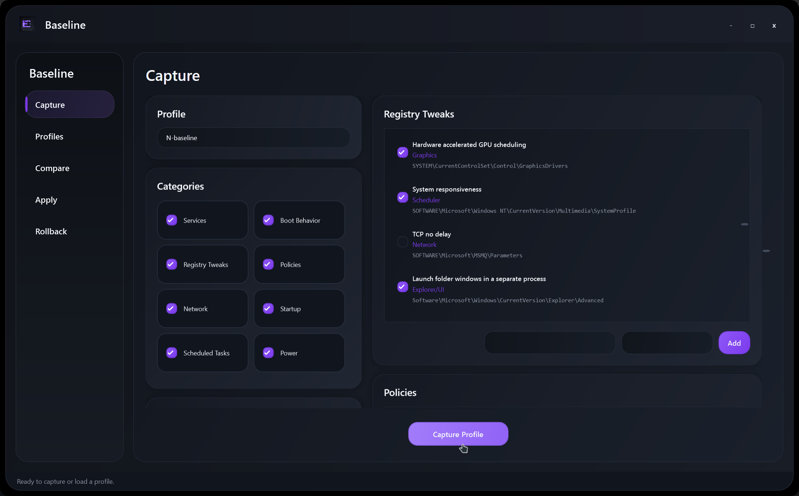

# Baseline

Baseline is a Windows utility for capturing, comparing, and replicating system configuration. It is designed to help you record a known-good setup, inspect what changed over time, and use that reference point when rebuilding or tuning another Windows installation.

## What It Does

- Captures a baseline snapshot of Windows configuration.
- Compares a current machine against a saved baseline.
- Helps replicate settings from a preferred setup.
- Gives you a repeatable reference point before and after system changes.

## Quick Start

1. Download or clone this repository.
2. Open the `Baseline` folder.
3. Run `BaseLine.exe` on Windows.
4. Capture a baseline before making major system changes.
5. Compare later snapshots to understand what changed.

## Repository Contents

| Path | Description |
| --- | --- |
| `Baseline/BaseLine.exe` | Windows executable for the app. |
| `Baseline/BaseLine.dll` | Application runtime assembly. |
| `Baseline/BaseLine.runtimeconfig.json` | .NET runtime configuration. |
| `Baseline/Assets/` | App assets used by the executable. |
| `image.png` | Screenshot used in this README. |

## Recommended Workflow

1. Start from a clean or freshly tuned Windows setup.
2. Run Baseline and save a reference snapshot.
3. Make your system changes, installs, or tweaks.
4. Capture or compare again to review the difference.
5. Keep the baseline somewhere safe so it can be reused later.

## Requirements

- Windows
- .NET 8 runtime, if the app does not start on your machine
- Administrator permissions may be needed for some system-level configuration checks

## Notes

Baseline is intended for configuration tracking and repeatable setup work. Review any changes before applying them to another machine, especially when moving between different Windows versions, hardware, or user accounts.

## Project Status

This repository currently contains a published build of the app. Source code, releases, and detailed capture format documentation can be added later as the project grows.
